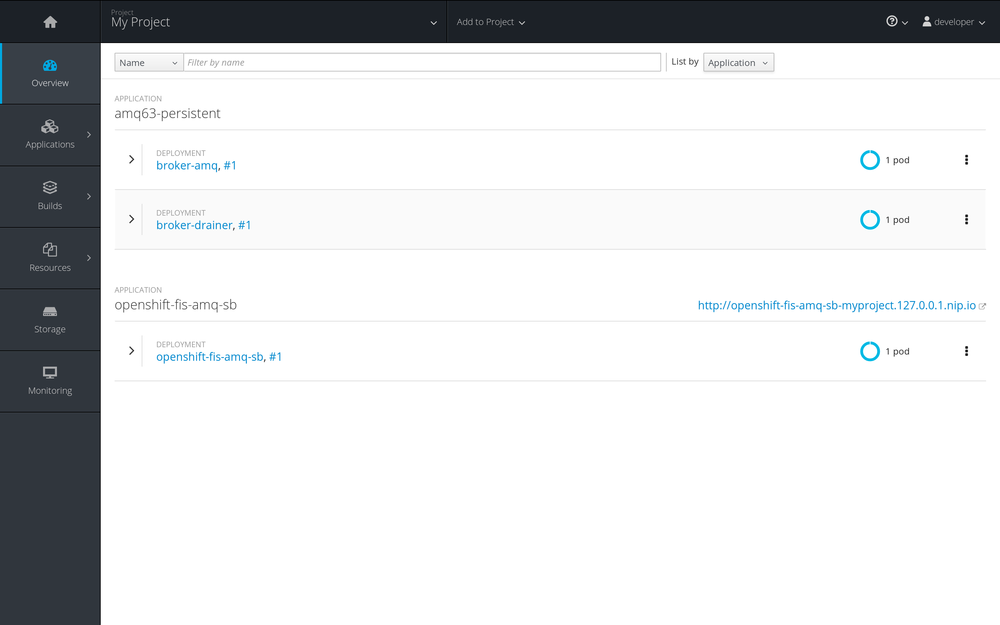
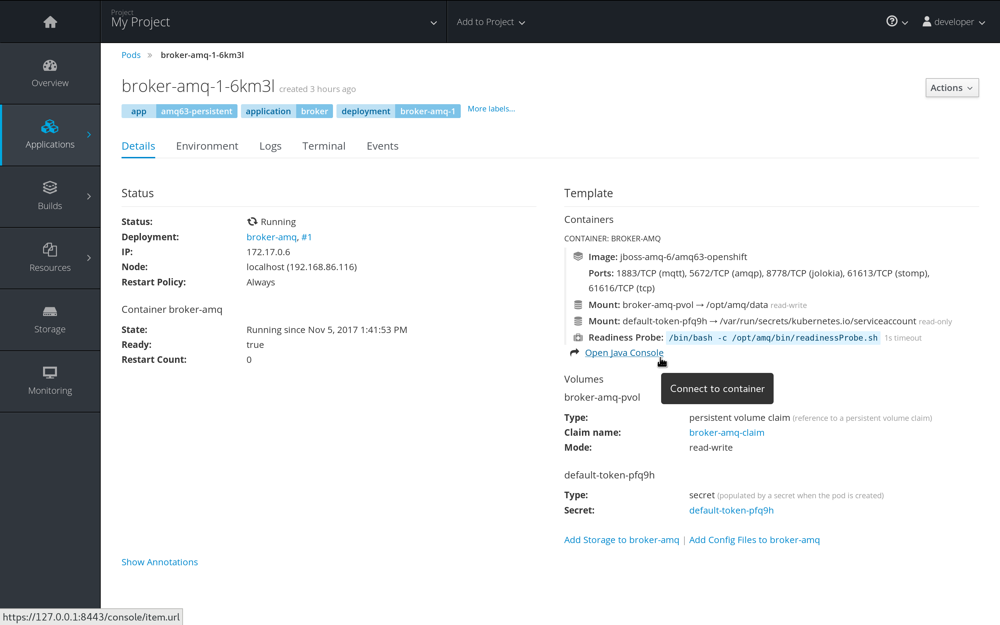
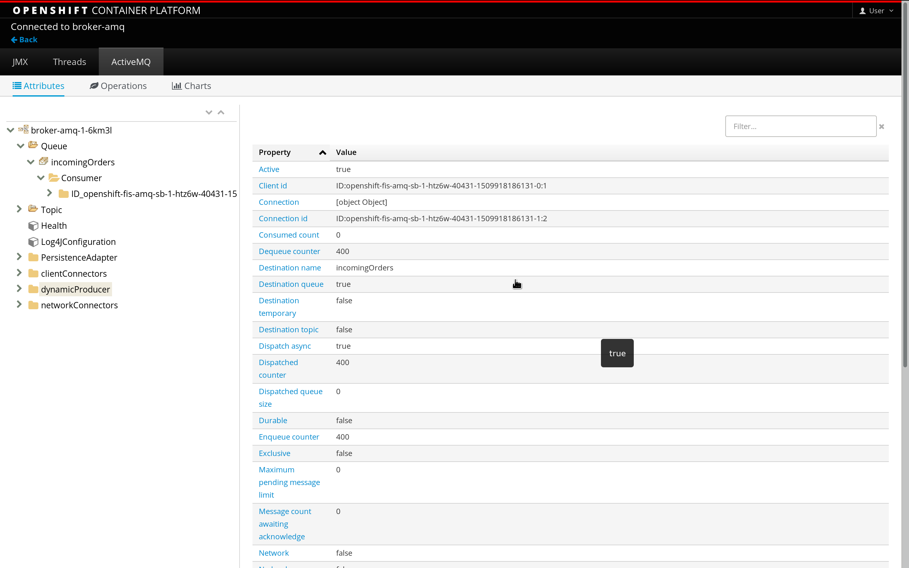
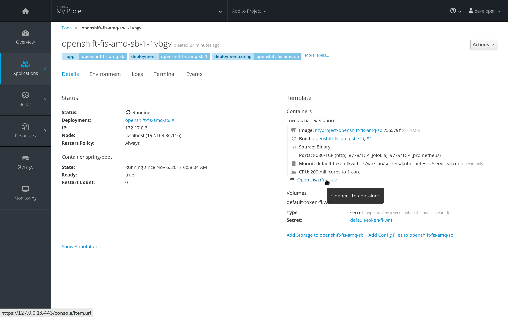
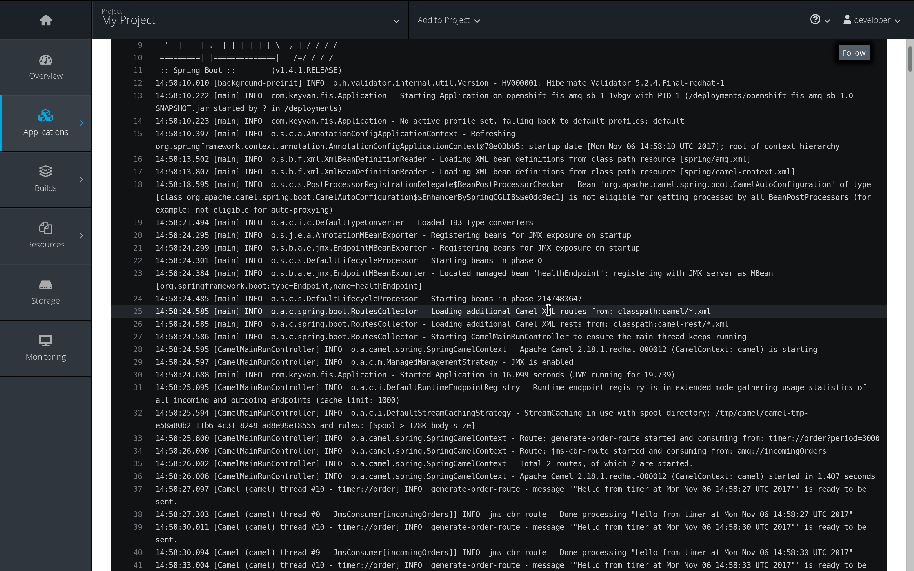
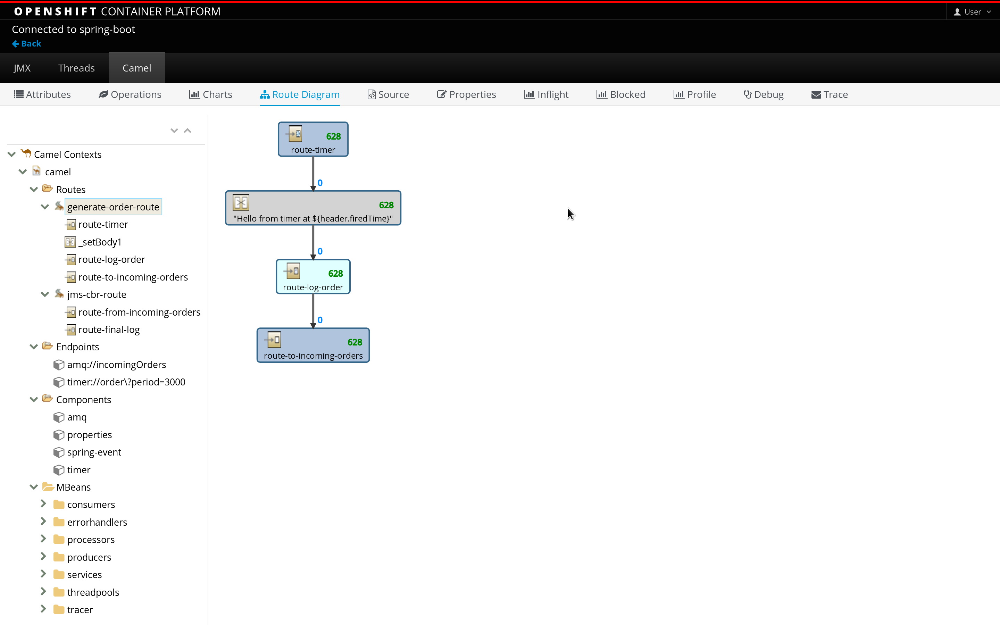

# Spring Boot, Camel and ActiveMQ QuickStart

This quickstart shows how to connect a Spring-Boot application to an A-MQ xPaaS message broker and use JMS messaging between two Camel routes using OpenShift.

## Setup OpenShift Container Platform Locally

**Step 1: Start OpenShift**

If using RHEL/Fedora, run the following command to bring up the latest version of **OCP 3.6** environment:

```sh
sudo oc cluster up --image registry.access.redhat.com/openshift3/ose --version v3.6.173.0.49-4
```

Whether using [Minishift](https://docs.openshift.org/latest/minishift/getting-started/installing.html) or the above command, the successful start of the **Openshift Container Platform** locally would output connectiion details as shown below 

```
Starting OpenShift using registry.access.redhat.com/openshift3/ose:v3.6.173.0.49-4 ...
OpenShift server started.

The server is accessible via web console at:
    https://127.0.0.1:8443

You are logged in as:
    User:     developer
    Password: <any value>

To login as administrator:
    oc login -u system:admin

```

The above startup script will also create a sample project **myproject** when you log into the URL https://127.0.0.1:8443 with the developer credentials as outputted in the above log.

**Step 2: Login as admin and install OpenShift templates**

From the root of this project folder run the following commands. As can be read in the comments for each command, the commands ensure that right images for the desired applications can be located and the application can be started with all possible configuration options.

```sh
# Log in as administrator
sudo oc login -u system:admin

# Create JBoss image streams in the openshift namespace
sudo oc create -f src/main/resources/ocp-templates/jboss-image-streams.json -n openshift

# Create AMQ 6.3 template for use in other projects
sudo oc create -f src/main/resources/ocp-templates/amq63-persistent.json -n openshift
```

**Step 3: Login as developer and create new amq application using the template**

From the root of this project folder run the following commands: 

```sh
# Log in as developer into the default project
oc login -u developer

# Create a new application in myproject namespace with certain environment settings
oc new-app --env AMQ_USER=keyvan --env AMQ_PASSWORD=keyvan --template=amq63-persistent 
```

**Step 4: Explore the project and the newly installed AMQ broker app**

Following image is what you should see (except for application **openshift-fis-amq-sb**) in your default project namespace. Click on the blue pod circle to the right of the **broker-amq** deployment. It will take you to the pod details shown in the next image.



One can visually see all the pod related details including the environment variables and ability to open up the **Java console** for exploring the **JMX** mbeans of the AMQ broker running in the pod. If you carefully notice, in the environment variables tab, there is a **AMQ_USER** and **AMQ_PASSWORD** that would be used to create queues and topics by the application as desired.



Below is the how the **Java Console** for the AMQ Broker pod looks like. The queue **incomingOrders** is automatically created once this application is deployed to the OpenShift.




## Deploy the Camel SpringBoot application on OpenShift

The [**fabric8 Maven plugin (f-m-p)**](https://maven.fabric8.io/) lets you deploy your Java application onto Kubernetes or OpenShift. The plugin in the Maven configuration would try to automatically build either for Kubernetes or for Openshift upon contact with the API server as configured for example with `oc login`.

We will use the `fabric8:deploy` to deploy the application onto Openshift. The `fabric8:deploy` will internally run `fabric8:resource` and `fabric8:build` before pushing the application image onto Openshift. Please refer to the f-m-p website link provided above for more in-depth details on each goals listed here.

To deploy the application on the OpenShift platform we stood up, we run only two commands in the order shown below:

```sh 
# Login as Developer, provide any password for the account
oc login -u developer

# Run the fabric8:deploy command
mvn fabric8:deploy
```

The complete log of the last command would show all the maven goals that are executed in sequence and how the f-m-p finally packages everything (build mode of OpenShift and build strategy of S2I) in the last step to push the application image to OpenShift. 

Sequence of goals executed (ignore the plugin version #s):

1. maven-resources-plugin:2.6:resourcesmaven-compiler-plugin:3.3:testCompile
2. fabric8-maven-plugin:3.5.32:resource
3. maven-compiler-plugin:3.3:compile
4. maven-resources-plugin:2.6:testResources
5. maven-compiler-plugin:3.3:testCompile
6. maven-surefire-plugin:2.18.1:test
7. maven-jar-plugin:2.4:jar
8. spring-boot-maven-plugin:1.4.1.RELEASE:repackage
9. fabric8-maven-plugin:3.5.32:build

### Explore the deployed application

Refer to the first image of this documentation and your entire project on the OpenShift cluster should look exactly as shown there. Now explore the application further by clicking on the pod (blue circle) to the right of the application deployment name **openshift-fis-amq-sb**. You should see a similiar image as shown below. 



At this point you can look at the Environment, Logs or into the guts of the application by clicking on the **Java Console** link. 

As you can see in the logs in one route a timer triggers a message to the AMQ and in another route the queue is read for any new messages and the content (body) of the message is printed.



The Java Console showing the Hawtio console for the Camel application currently displaying the route layout for one of the routes along with MBeans of the application's JVM.




